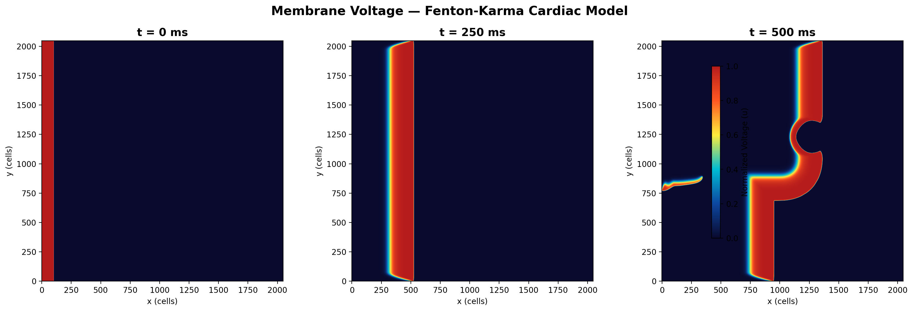
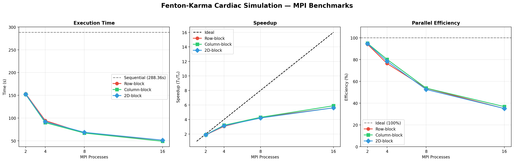

# Parallel Cardiac Electrophysiology Simulation

MPI-parallel 2D cardiac tissue simulation using the Fenton-Karma three-variable ionic model, with S1-S2 cross-field stimulation to induce spiral wave reentry.



**Course:** Parallel & Distributed Computing (CS-315) — NUST SINES

---

## Overview

This project simulates electrical wave propagation through a 2D sheet of human ventricular tissue. The Fenton-Karma model represents three transmembrane currents (fast inward Na⁺, slow outward K⁺, slow inward Ca²⁺) using three state variables, making it computationally tractable for large-scale parallel simulation while reproducing key features of cardiac action potential dynamics including restitution, alternans, and spiral wave breakup.

The simulation includes an ischemic scar zone (circular region with 90% reduced diffusion coefficient) that interacts with the propagating wavefront.

Three MPI domain decomposition strategies are implemented and benchmarked against each other:

| Strategy | Decomposition | Halo Exchange | Topology |
|----------|--------------|---------------|----------|
| Row-block | Horizontal strips | North/south (contiguous rows) | Linear |
| Column-block | Vertical strips | East/west (packed columns) | Linear |
| 2D-block | Checkerboard | 4-directional | MPI Cartesian |

## Benchmark Results

Full benchmark on AMD Ryzen 9 AI 365 (10C/20T), 2048×2048 grid (4.19M cells), 5000 time steps (500 ms simulated):



| Strategy | Procs | Time (s) | Speedup | Efficiency |
|----------|------:|--------:|---------:|----------:|
| Sequential | 1 | 288.36 | 1.00x | 100.0% |
| Row-block | 2 | 153.38 | 1.88x | 94.0% |
| Row-block | 4 | 94.39 | 3.06x | 76.4% |
| Row-block | 8 | 67.15 | 4.29x | 53.7% |
| Row-block | 16 | 51.44 | 5.61x | 35.1% |
| Column-block | 2 | 151.86 | 1.90x | 94.9% |
| Column-block | 4 | 89.92 | 3.21x | 80.2% |
| Column-block | 8 | 67.00 | 4.30x | 53.8% |
| Column-block | 16 | 48.96 | 5.89x | 36.8% |
| 2D-block | 2 | 152.38 | 1.89x | 94.7% |
| 2D-block | 4 | 91.98 | 3.13x | 78.4% |
| 2D-block | 8 | 68.60 | 4.20x | 52.6% |
| 2D-block | 16 | 51.43 | 5.61x | 35.1% |

### Observations

> **Note:** The benchmarks below were collected before column halo buffers were moved from per-step allocation to pre-allocated reuse. The results are therefore conservative for column-block and 2D-block strategies (they include per-step `malloc`/`free` overhead that no longer exists). A rerun with the current code is planned.

- All three strategies achieve near-ideal speedup at 2 processes (~94% efficiency), consistent with the high computation-to-communication ratio of a 2048² stencil.
- Efficiency drops at higher process counts due to increasing surface-to-volume ratio (more halo relative to interior) and Amdahl's-law effects from the sequential gather in `save_snapshot`.
- Column-block slightly outperforms row-block at 16 processes (5.89x vs 5.61x), likely because column strips have a smaller halo perimeter at these aspect ratios.
- 2D-block does not show the expected advantage at this scale, possibly because `MPI_Dims_create` produces suboptimal factorizations for non-square process counts and the column-packing overhead in east/west halo exchange partially offsets the reduced halo perimeter.
- The `--oversubscribe` flag was used for runs with >10 processes (machine has 10 physical cores), meaning 16P runs experience context-switching overhead that masks any decomposition differences.

### Benchmark Methodology

- All 13 runs executed sequentially via `run_benchmark.sh` on a single machine (no other user load).
- Timing: `MPI_Wtime()` across the full time-stepping loop, which includes computation, halo exchange, and periodic snapshot gather/write operations.
- Reported time is `MPI_Reduce(..., MPI_MAX)` (wall-clock of the slowest process).
- Speedup = T₁ / Tₚ (sequential baseline / parallel time).
- Efficiency = Speedup / P × 100%.
- Snapshots saved every 2500 steps; the gather and file write are included in the timed interval. For a pure compute-only benchmark, set `snapshot_interval` to 0 or greater than `num_steps`.

## Physics Model

**Fenton-Karma 3-Variable Model** (Parameter Set 1 — human ventricle):

- Three ionic currents: J_fi (fast inward, Na⁺), J_so (slow outward, K⁺), J_si (slow inward, Ca²⁺)
- Two gating variables: v (fast recovery), w (slow recovery)
- Spatial coupling: 5-point diffusion stencil with spatially varying diffusion coefficient
- Ischemic scar zone: circular region at (0.6N, 0.6N) with radius 0.08N, diffusion reduced to 10% of baseline
- Stimulus protocol: S1 planar wave from left edge (t = 0–2 ms), S2 cross-field in lower-left quadrant (t = 300–302 ms) to induce spiral reentry
- Integration: forward Euler, Δx = Δy = 0.025 cm, Δt = 0.1 ms, D = 0.001 cm²/ms

Reference: Fenton, F. & Karma, A. (1998). Vortex dynamics in three-dimensional continuous myocardium with fiber rotation. *Chaos*, 8(1), 20–47.

## Build & Run

### Requirements

- C compiler with MPI support (`mpicc`, typically from OpenMPI or MPICH)
- Python 3 with NumPy and Matplotlib (for visualization only)

### Compile

```bash
make
```

### Quick Test

Verify everything works on a small grid before running the full benchmark:

```bash
chmod +x run_quick_test.sh
./run_quick_test.sh
```

This runs 512×512, 1000 steps — takes about a minute.

### Full Benchmark

```bash
chmod +x run_benchmark.sh
./run_benchmark.sh
```

Runs 13 configurations (1–16 processes × 3 strategies) on a 2048×2048 grid. Takes 30–60 minutes depending on hardware.

### Visualize

```bash
python3 scripts/visualize.py
```

Generates `results/voltage_snapshots.png` and `results/benchmark_plots.png`.

### Correctness Validation

Verify that all decomposition strategies produce numerically identical results to the serial reference:

```bash
chmod +x run_validate.sh
./run_validate.sh
```

This runs a 256×256, 500-step simulation sequentially, then with 4 processes for each decomposition strategy, and compares the final voltage field. Expected output: max absolute error < 1e-10 for all strategies (differences arise only from floating-point accumulation order).

### Manual Run

```bash
mpirun -np 8 ./cardiac_sim <strategy> <grid_size> <num_steps> <snapshot_interval>
# strategy: 1=Row-block, 2=Column-block, 3=2D-block
# Example:
mpirun -np 8 ./cardiac_sim 3 2048 5000 2500
```

## Repository Structure

```
.
├── src/cardiac_sim.c       # MPI simulation (Fenton-Karma + decomposition + halo exchange)
├── scripts/
│   ├── visualize.py        # Voltage heatmaps + benchmark plots
│   └── validate.py         # Serial-vs-parallel correctness comparison
├── results/
│   ├── benchmark.csv       # Raw timing data (13 runs)
│   ├── benchmark_plots.png # Speedup/efficiency curves
│   └── voltage_snapshots.png # Membrane voltage at t=0, 250, 500 ms
├── run_benchmark.sh        # Automated 13-run benchmark suite
├── run_quick_test.sh       # Quick sanity check (512×512)
├── run_validate.sh         # Correctness validation (serial vs parallel)
├── Makefile
└── LICENSE
```

## License

MIT
